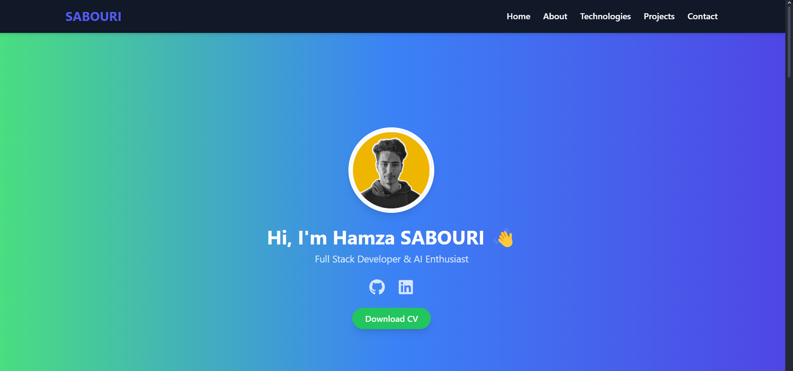
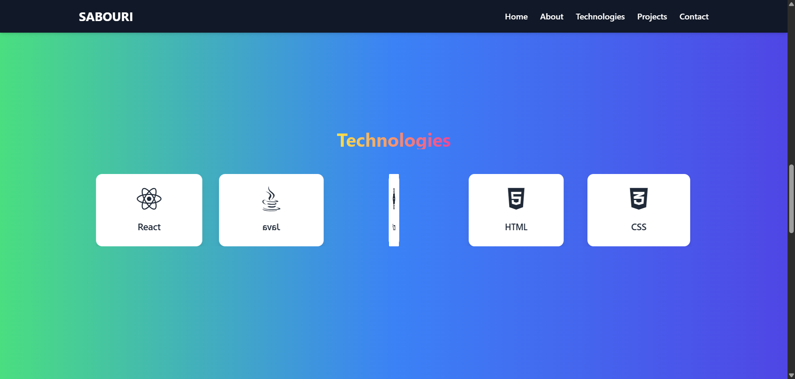
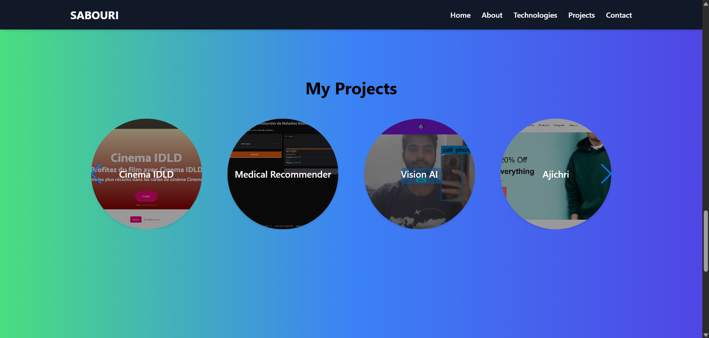
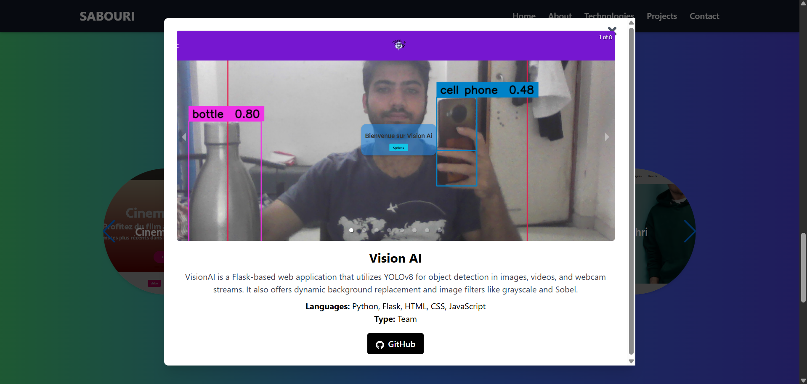
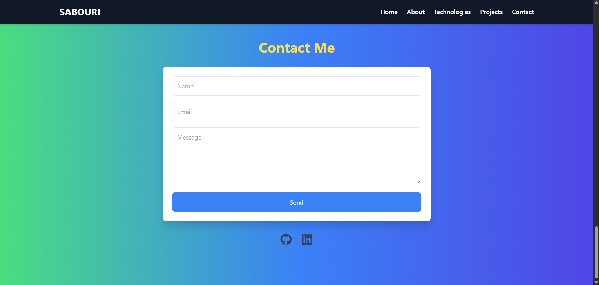

# **Sabouri Portfolio**

Bienvenue sur le portfolio de **Hamza Sabouri**, un développeur full-stack passionné par l'IA et les technologies web.


## **Table des matières**

- [Description du projet](#description-du-projet)
- [Démonstration](#Démonstration)
- [Technologies utilisées](#technologies-utilisées)
- [Installation](#installation)
- [Fonctionnalités](#fonctionnalités)


## **Description du projet**

Ce projet est un **portfolio interactif** construit avec **React**, **Tailwind CSS** et **Vite**. Il présente mes projets, mes compétences, ainsi que mes informations de contact. Ce portfolio sert de vitrine pour mes travaux en développement web et mes projets personnels dans les domaines du développement Full Stack et de l'intelligence artificielle.

### **Démonstration**









## **Technologies utilisées**

- **React.js** : Bibliothèque JavaScript pour la création de composants interactifs.
- **Tailwind CSS** : Framework CSS pour la conception de l'interface utilisateur.
- **Vite** : Outil de développement rapide pour React.
- **Framer Motion** : Librairie pour les animations et transitions fluides.
- **React Icons** : Icônes pour les réseaux sociaux et autres éléments.
- **Swiper** : Slider pour les projets.
- **EmailJS** : Service d'envoi de courriels pour la page de contact.

## **Installation**

1. Clonez ce repository sur votre machine locale :

```bash
git clone https://github.com/hamzasabouri/portfolio.git
cd portfolio
```

2. Installez les dépendances avec npm :

```bash
npm install
```
3. Lancez le projet en mode développement :

```bash
npm run dev
```
Le site sera accessible à http://localhost:5173/.

## **Fonctionnalités**
- **Page d'accueil** : Introduction et lien vers les sections principales.

- **Technologies** : Présentation des technologies utilisées avec des icônes animées.

- **Projets** : Galerie de mes projets avec une fonctionnalité de carrousel.

- **Contact** : Formulaire de contact utilisant EmailJS pour envoyer des messages directement.


